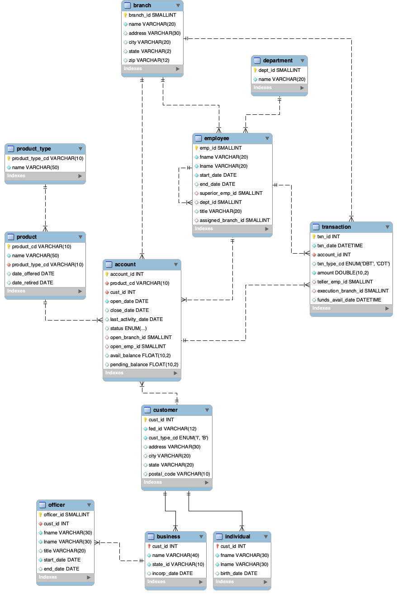

#learningsql

This repository is a walkthrough of the book "Learning SQL" by Alan Beaulieu.

Included with this walkthrough is how SQLAlchemy works.

The example SQL database is included in this repository in `LearningSQLExample.sql`

An ER diagram is also included below.

